# Natas

###### Solved by @jaumg2004

Natas é um wargame (jogo de guerra) online gratuito oferecido pelo site OverTheWire.  
O objetivo do jogo é testar e aprimorar habilidades de hacking ético e segurança de aplicações web, desafiando os participantes a encontrar vulnerabilidades em diferentes níveis para progredir no jogo.

---

## Natas 0

Natas 0 é o mais básico.


Para resolver, basta apenas clicar com o botão direito na página e depois clicar em **Inspecionar**,  
ou usar **Ctrl+U** para abrir o HTML da página.

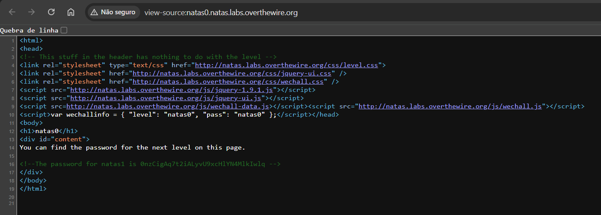

**Senha:** `0nzCigAq7t2iALyvU9xcHlYN4MlkIwlq`

---

## Natas 1

No Natas 1 há um bloqueio que não permite inspecionar o HTML da página diretamente:

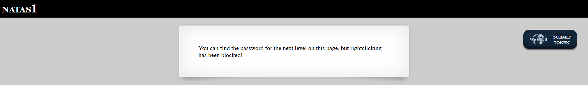

Mas ainda é possível acessar o código-fonte apertando **Ctrl+U**,  
encontrando assim a senha para o Natas 2:

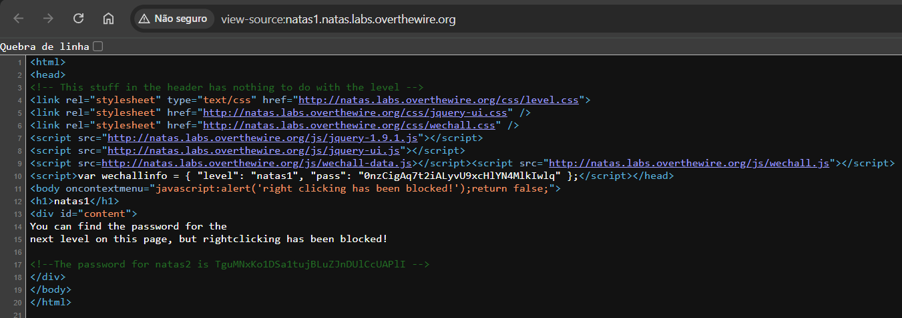

**Senha:** `TguMNxKo1DSa1tujBLuZJnDUlCcUAPlI`

---

## Natas 2

Aqui já ocorre uma mudança.  
A mensagem inicial desse nível diz que “não há nada nessa página”:

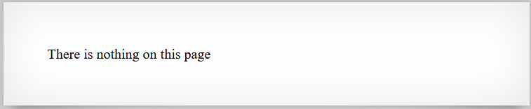

Ao acessar o HTML da página, não é possível encontrar diretamente a senha para o Natas 3:

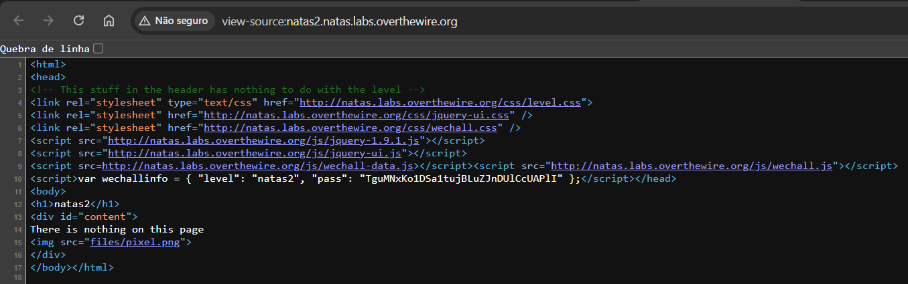

Porém, há um link para `files/pixel.png`, que leva para uma página com apenas um pixel branco no meio:

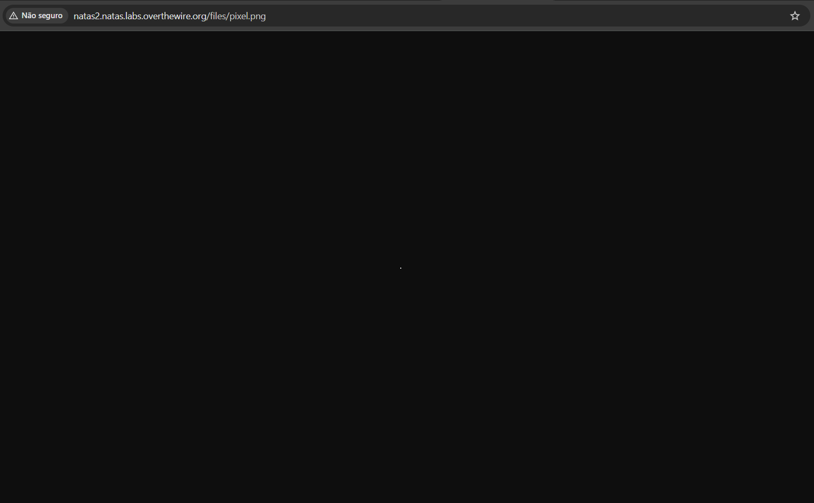

O segredo está justamente no link, pois essa imagem está armazenada em uma pasta acessível pelo Natas 2.  
Ao remover `pixel.png` e acessar apenas o diretório `files/` no domínio, somos levados para:

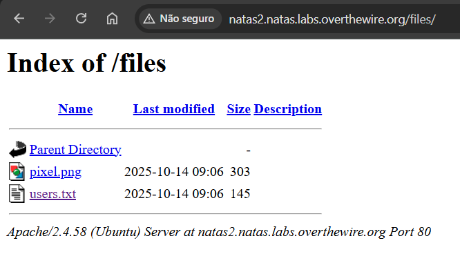

Clicando em `users.txt`, encontramos a senha para o próximo nível:

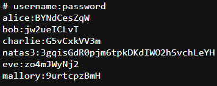

**Senha:** `3gqisGdR0pjm6tpkDKdIWO2hSvchLeYH`

---

## Natas 3

Nesse nível aparece a mesma mensagem de que “não há nada aqui”:


Mas, diferente do nível anterior, aqui é necessário saber o que é um arquivo **`robots.txt`**.

Um arquivo `robots.txt` é um arquivo de texto que instrui os robôs (ou “crawlers”) de mecanismos de busca sobre quais partes de um site eles podem ou não rastrear e indexar.  
Ele é usado para gerenciar o tráfego do site e controlar a forma como o conteúdo é acessado, evitando que partes indesejadas (como páginas de login, carrinhos de compras ou arquivos administrativos) apareçam nos resultados de pesquisa.

Ao adicionar `/robots.txt` ao domínio da página, você verá o caminho `/s3cr3t/`:

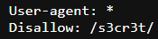

Acessando esse caminho, você é levado a uma página com arquivos indexados, onde está o arquivo `users.txt` com a senha do próximo Natas:

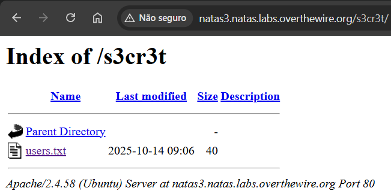

Diferente dos outros desafios, aqui foi necessário um certo conhecimento de desenvolvimento web, mostrando que a segurança começa desde o planejamento e construção da aplicação.

**Senha:** `QryZXc2e0zahULdHrtHxzyYkj59kUxLQ`

---

## Natas 4

A mensagem inicial dessa fase é a seguinte:

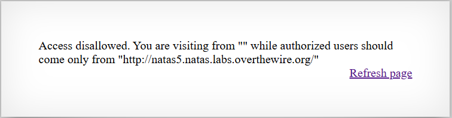  

> “Acesso não permitido. Você está acessando de "" enquanto usuários autorizados devem acessar somente de `http://natas5.natas.labs.overthewire.org/`”

Para resolver esse nível, é necessário utilizar uma ferramenta do Kali Linux: **Burp Suite**.

**Burp Suite** é uma plataforma de ferramentas de segurança para testar aplicações web, usada por profissionais para encontrar e explorar vulnerabilidades.  
Ela funciona como um *proxy* para interceptar, analisar e modificar o tráfego HTTP entre um navegador e um servidor.  
A ferramenta inclui várias subferramentas, como **Proxy**, **Repeater** e **Intruder**, e está disponível em uma versão gratuita (*Community Edition*) e em versões pagas com mais funcionalidades.

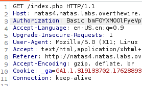

Ao fazer a captura com o Burp Suite, conseguimos visualizar as requisições da página.  
O que nos interessa aqui é o cabeçalho **`Referer`**, que indica o domínio de onde estamos chegando.

Para conseguir a senha do Natas 5, temos que alterar o valor do `Referer` para o domínio do Natas 5:

```text
http://natas5.natas.labs.overthewire.org/
```

**Senha:** `0n35PkggAPm2zbEpOU802c0x0Msn1ToK`

---

## Natas 5

A mensagem desse nível é:  
**“Acesso não permitido. Você não está conectado.”**

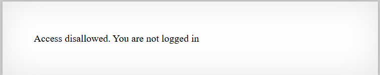

Pra resolver esse nível, é necessário entender o que é um **cookie de internet**.

Cookies são pequenos arquivos de texto que sites enviam para o navegador e que ficam armazenados no seu dispositivo. Eles servem para que o site “lembre” de você e das suas preferências de navegação.  
Podem, por exemplo:

- Manter você logado  
- Lembrar itens no carrinho de compras  
- Guardar o idioma preferido  
- Ajudar na segurança e em publicidade direcionada  

Ou seja, cookies permitem que os sites “lembrem” informações de uma visita para outra.

Sabendo disso:

1. Clique com o botão direito na página e selecione **Inspecionar**:  
   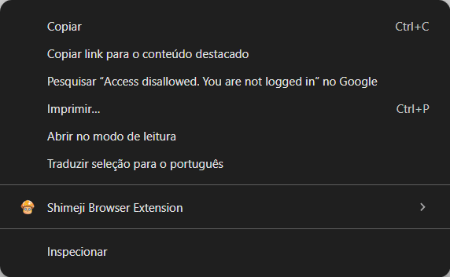

2. Depois vá até a aba **Application** (ou **Armazenamento** / **Aplicativo**, dependendo do navegador):  
   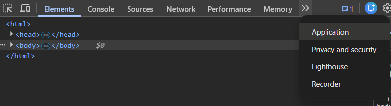

3. No cookie do Natas 5, altere o valor do cookie `loggedin` para `1` e atualize a página.  
   Ao fazer isso, a página revelará a senha:  
   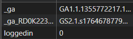  
   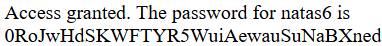

**Senha:** `0RoJwHdSKWFTYR5WuiAewauSuNaBXned`

---

## Natas 6

Nesse nível, à primeira vista, parece haver apenas uma entrada de dados “normal”:

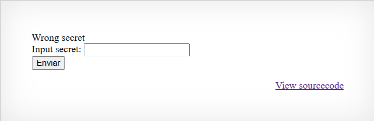

No botão **“View sourcecode”**, você é levado ao HTML da página.  
No código-fonte, existe a seguinte lógica / condicionamento:

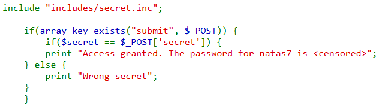

Observando o código, é possível perceber que há um arquivo incluído: `includes/secret.inc`.

Ao adicionar esse caminho ao domínio original:

```text
http://natas6.natas.labs.overthewire.org/includes/secret.inc
```
você é levado a outra página, que contém a seguinte string:

```text
FOEIUWGHFEEUHOFUOIU
```

Inserindo esse valor no campo de entrada da página principal, a senha do próximo Natas é exibida:

**Senha:** `bmg8SvU1LizuWjx3y7xkNERkHxGre0GS`

---

## Natas 7

Pra resolver esse nível, primeiro é importante entender o que é **Path traversal**.


**Path traversal** é uma vulnerabilidade de segurança que permite a um atacante acessar arquivos e diretórios que não deveriam estar publicamente disponíveis em um servidor web ou sistema de arquivos. A vulnerabilidade ocorre quando uma aplicação web ou software usa entradas de usuário (como parâmetros de URL ou campos de formulário) para construir um caminho de arquivo sem a validação ou sanitização adequada. 

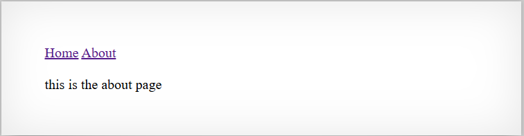


Os dois botões da página, **"Home"** e **"About"**, estão ligados a consultas de arquivos.  
Isso fica claro ao observar o domínio, que muda quando você clica em cada um:

- `http://natas7.natas.labs.overthewire.org/index.php?page=about`  
- `http://natas7.natas.labs.overthewire.org/index.php?page=home`

Ou seja, o valor do parâmetro `page` é usado pelo servidor para decidir o que carregar.

Para testar se a aplicação é vulnerável, você pode **alterar manualmente o domínio/URL**, modificando o valor do parâmetro `page`:

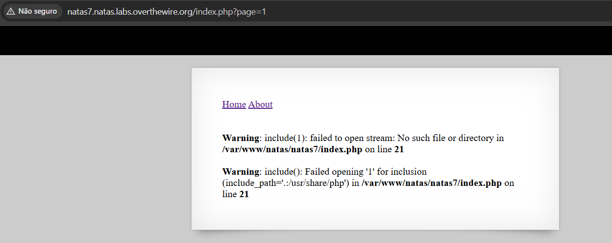

Além disso, ao inspecionar o **código-fonte HTML** da página, você encontra a seguinte dica:

```text
<!-- hint: password for webuser natas8 is in /etc/natas_webpass/natas8 -->
```

Isso indica que o arquivo `/etc/natas_webpass/natas8` contém a senha do próximo nível.

Como o parâmetro `page` é usado para carregar conteúdo, você pode tentar passar diretamente o caminho indicado na dica:

```text
http://natas7.natas.labs.overthewire.org/index.php?page=/etc/natas_webpass/natas8
```

Que levará a senha do Natas 8

**Senha:** `xcoXLmzMkoIP9D7hlgPlh9XD7OgLAe5Q`

---

## Natas 8

A página desse natas se assemelha ao do Natas 6 


Quando clica no botão do **“View sourcecode”**, no HTML da página tem o seguinte condicionamento: 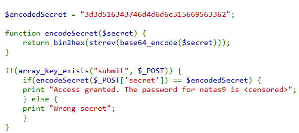

Como pode se perceber a solução está na chave `3d3d516343746d4d6d6c315669563362`

A função **"encodeSecret"** converte a mensagem em `base64`, depois a reverte e converte pra hexadecimal. Pra solucionar, basta pegar a chave e fazer o caminho contrário

Usando um decodifcador hexadecimal pra texto, obtem-se `==QcCtmMml1ViV3b`, invertendo fica `b3ViV1lmMmtCcQ==`, colocando em um decodificador de `base64`, tem-se a string `oubWYf2kBq`

Colocando na entrada, devolve a senha pro proximo Natas: 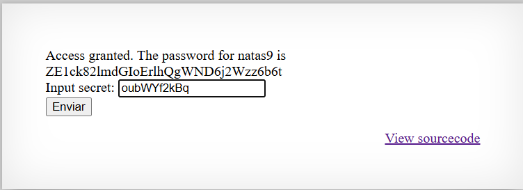

**Senha:** `ZE1ck82lmdGIoErlhQgWND6j2Wzz6b6t`

---

## Natas 9

Para essa tarefa é preciso saber os conceitos de Command Injection

O **Command Injection** (ou Injeção de Comando) é uma vulnerabilidade de segurança grave que ocorre quando um invasor consegue executar comandos arbitrários no sistema operacional (OS) do servidor que hospeda uma aplicação web. Essencialmente, o invasor "injetta" comandos do sistema em um formulário ou parâmetro de entrada que a aplicação processa sem a devida higienização.

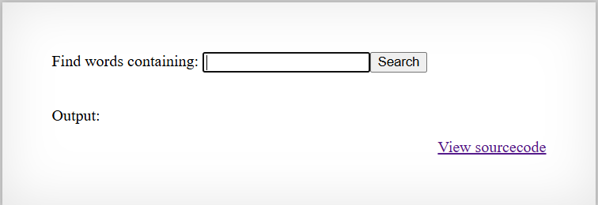

Pra muitas linguagens de programação e marcação, uma maneira de fazer Command Injection é quebrar a linha usando `;` e depois o comando que deseja ser executado.

Colocando o comando `; cat /etc/natas_webpass/natas10` na entrada você tem a senha do próximo natas

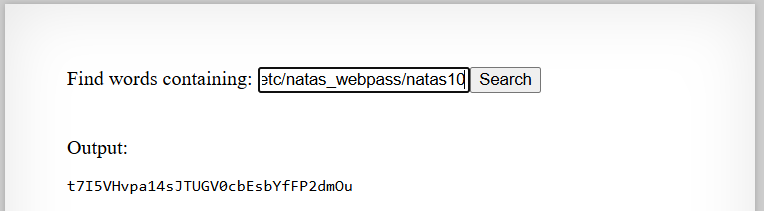

**Senha:** `t7I5VHvpa14sJTUGV0cbEsbYfFP2dmOu`

---

## Natas 10

Nesse nível tem uma filtragem pra quebra de linhas, mas não significa que pode fazer Command Injection.


No Linux/Unix o comando `-a` é uma ferramenta para modificar o comportamento do comando principal.

Colocando na entrada o comando:
``` text
-a /etc/natas_webpass/natas11 dictionary.txt
```

Te devolve a senha pro proximo nível:
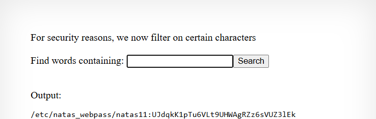

**Senha:** `UJdqkK1pTu6VLt9UHWAgRZz6sVUZ3lEk`

---