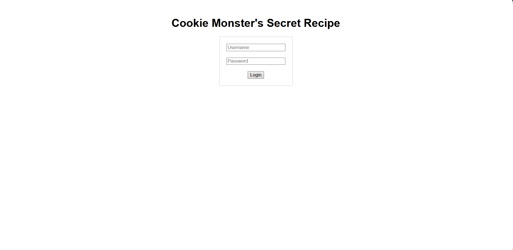
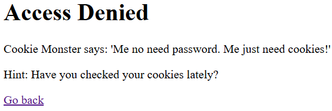
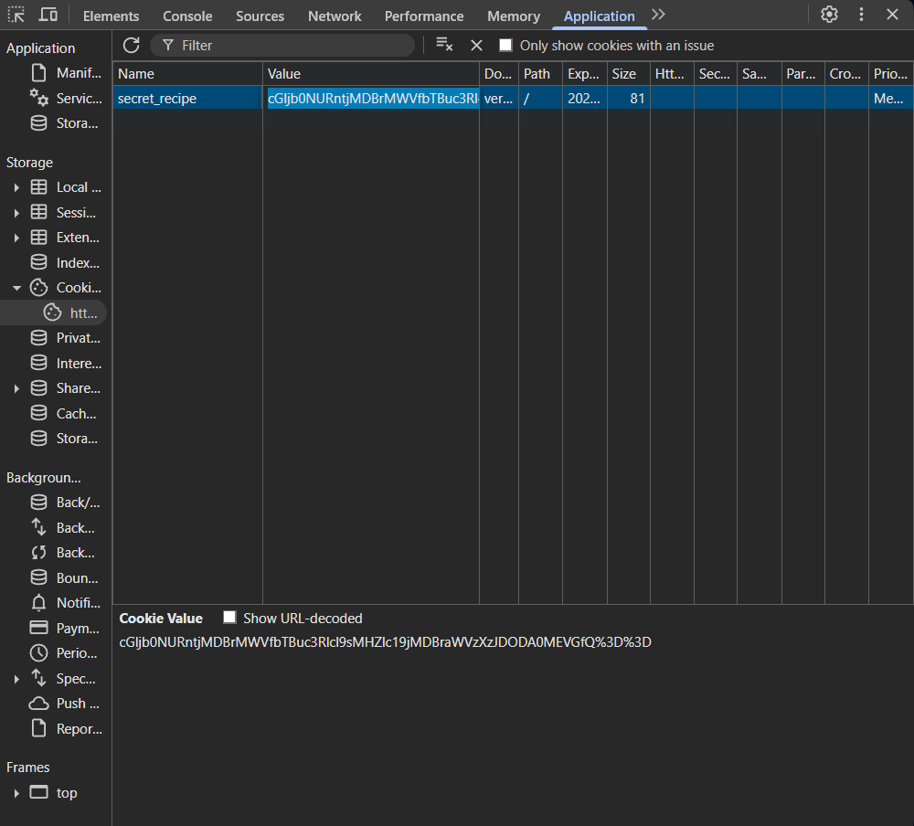
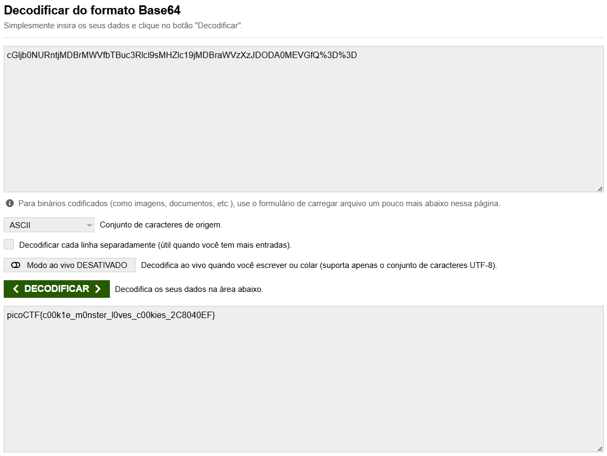

# Cookie Monster Secret Recipe 

###### Solved by @jaumg2004

### Descrição do desafio
 
O Monstro dos Come-Come escondeu sua receita secreta de biscoitos em algum lugar do seu site. Como um aspirante a detetive de biscoitos, sua missão é descobrir esse segredo delicioso. Você consegue enganar o Monstro dos Come-Come e encontrar a receita escondida?

### Resolução

Inicialmente é fornecido um link http://verbal-sleep.picoctf.net:52271/, este link vai pra uma página de login e senha

Ao tentar entrar com login e senha voc~e se depara com a seguinte mensagem 

Ao voltar pra página de login e senha, porém dessa vez, ao clicar em Ctrl+U pra inspesionar a página, e ir na aba de aplicação pra procurar os cookies, você encontra o seguinte valor:

Este cookie `cGljb0NURntjMDBrMWVfbTBuc3Rlcl9sMHZlc19jMDBraWVzXzJDODA0MEVGfQ%3D%3D` está criptografado em Base64. Ao jogar o cookie em um decodificador, a flag é retornada

### Flag

`picoCTF{c00k1e_m0nster_l0ves_c00kies_2C8040EF}`