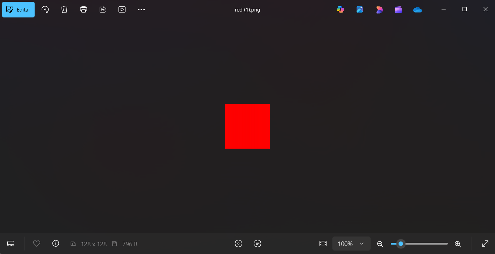
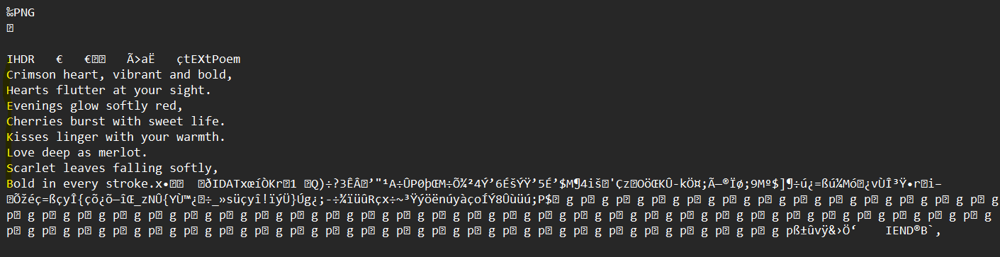
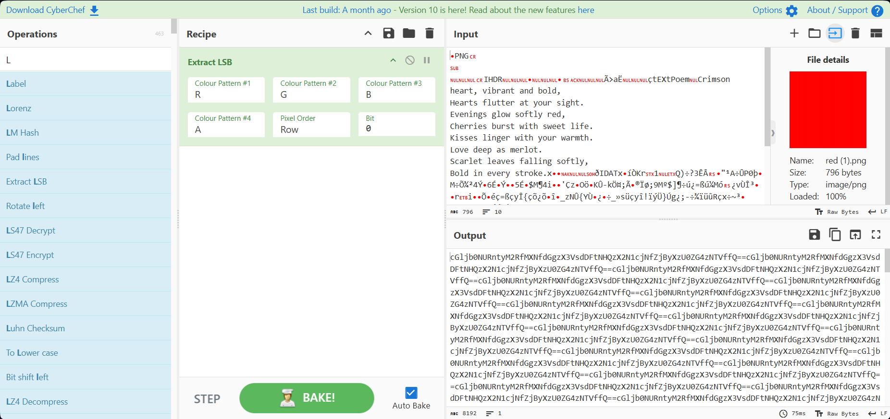
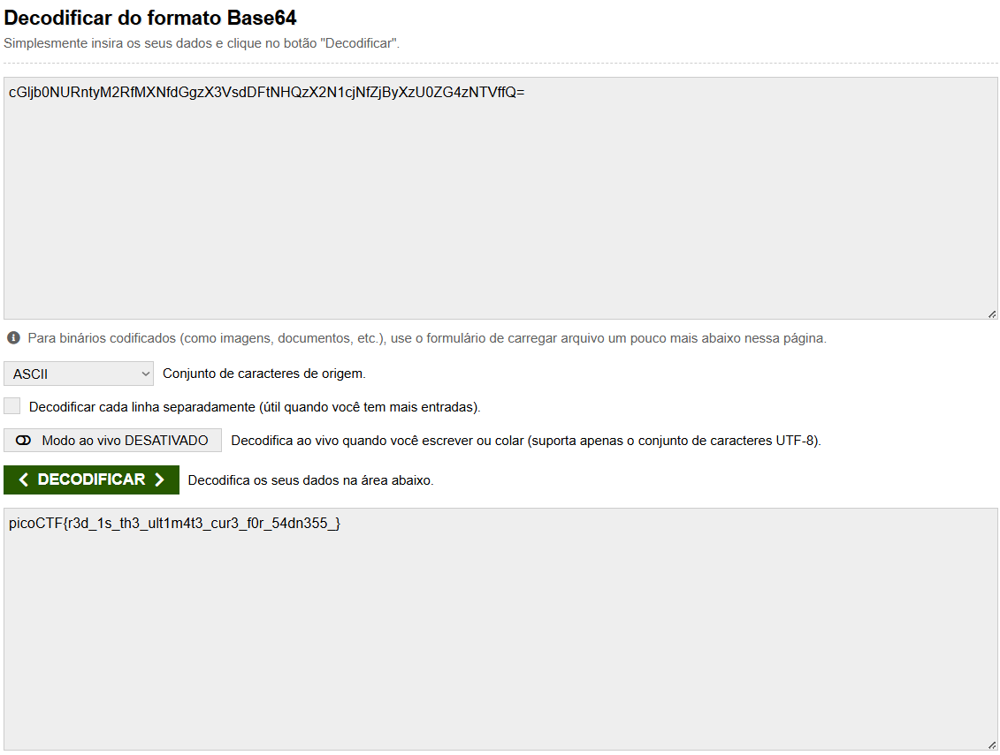

# RED

###### Solved by @jaumg2004

### Descrição

RED, RED, RED, RED
Download the image: [red.png](red.png)

### Resolução

A imagem da descrição inicialmente é só um quadrado vermelho.

Mas esse não é o metódo correto pra abrir a imagem!! Se abrir no bloco de notas ao invés do editor de imagem, aparece a seguinte mensagem:  
Com foco nas primeiras letras de cada frase, forma a palavra `Check LSB`. LSB é uma sigla pra 'least significant bit', ou, bit menos significativo, envolve a incorporação de informações secretas dentro dos LSBs dos valores de pixels de uma imagem.
Colocando a ordem padrão de cor da imagem em um decodificador, obtem um texto codificado em Base64 repetido várias vezes:
Obs.: uma das dicas do desafio foi 'Red?Ged?Bed?Aed?', pegando a primeira letra de cada palavra, tem se a ordem do padrão de cor da imagem.

Texto codificado: `cGljb0NURntyM2RfMXNfdGgzX3VsdDFtNHQzX2N1cjNfZjByXzU0ZG4zNTVffQ=`

Colocando esse texto em um descodificador de Base64, obtem-se a flag 

### Flag

`picoCTF{r3d_1s_th3_ult1m4t3_cur3_f0r_54dn355_}`
