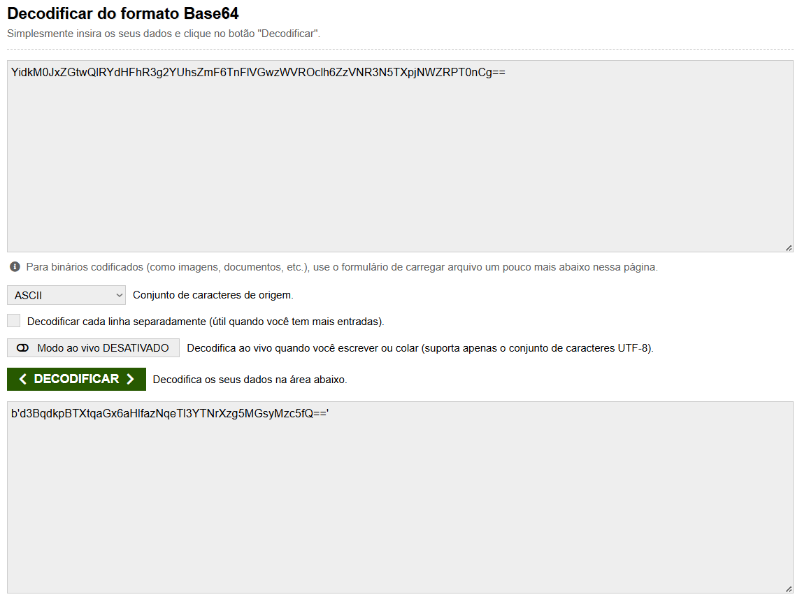
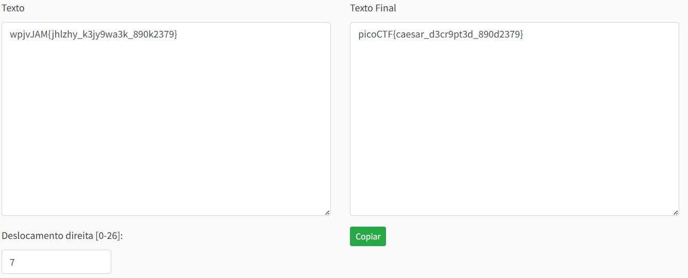

# interencdec

###### Solved by @jaumg2004

### Descrição

Consegue obter o real significado deste arquivo.
Baixe o arquivo [aqui](Tarefa1/interencdec/enc_flag).

### Resolução

Dentro arquivo possui o seguinte texto: `YidkM0JxZGtwQlRYdHFhR3g2YUhsZmF6TnFlVGwzWVROclh6ZzVNR3N5TXpjNWZRPT0nCg==`.
Essa string está codificado com Base64, ao descodificar optem este texto:
`b'd3BqdkpBTXtqaGx6aHlfazNqeTl3YTNrXzg5MGsyMzc5fQ=='`

Isso ainda não é flag, pois ainda está codificado com Base64. No enunciado do desafio tem a seguinte instância, "Envolver-se em vários processos de decodificação é de extrema importância", ou seja, tem que continuar descodificando até chegar na flag.
Pra isso desenvolvi esté código usando Python:

```
import base64, ast

encode = 'YidkM0JxZGtwQlRYdHFhR3g2YUhsZmF6TnFlVGwzWVROclh6ZzVNR3N5TXpjNWZRPT0nCg=='

decode1 = base64.b64decode(encode)
print(decode1)
obj = ast.literal_eval(decode1.decode('ascii').strip())

if isinstance(obj, str):
    obj = obj.encode('ascii')

decode2 = base64.b64decode(obj)
text = decode2.decode('ascii')
print(text)
```
Obs.: caso necessário, alterar o código pra continuar decodificando.

No final retorna `wpjvJAM{jhlzhy_k3jy9wa3k_890k2379}`, sendo essa a flag codificada com Cifra de Cesar. Basta utilizar um decodificador de CC, pra capturar a flag. 
Obs.: fui testando os deslocamentos de 0 á 26 até achar a flag

### Flag


`picoCTF{caesar_d3cr9pt3d_890d2379}`

